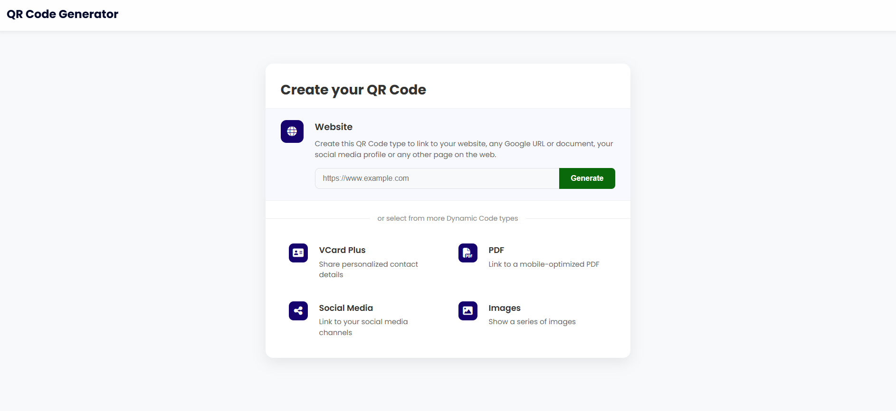
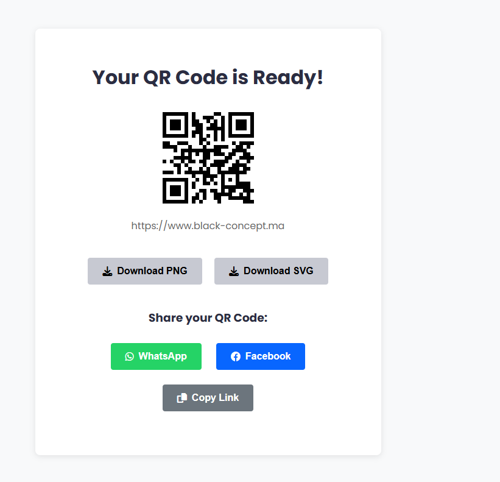

Overview
A web application for generating various types of QR codes including:

Website URLs

PDF documents

vCards (digital business cards)

Image galleries

Social media profiles

Built with Laravel, Bootstrap, and the SimpleSoftwareIO QR Code package.
User Experience
✨ Clean, responsive interface
✨ Real-time QR code preview
✨ Download QR codes as PNG/SVG
✨ File uploads with validation
✨ Mobile-friendly design

Installation
Requirements
PHP 8.1+

Composer

MySQL 5.7+

Node.js 16+

Laravel 10+

Setup Steps
Clone the repository:

bash
git clone https://github.com/Hidaya01/QrCodeGenerator.git
cd qr-generator

Install dependencies:

bash
composer install
npm install
Configure environment:

bash
cp .env.example .env
php artisan key:generate
Update .env with your database credentials:

ini
DB_DATABASE=your_db_name
DB_USERNAME=your_db_user
DB_PASSWORD=your_db_password

Run migrations:

bash
php artisan migrate
Build assets:

bash
npm run build
Start development server:

bash
php artisan serve
Usage
Generating QR Codes
Select a QR code type from the homepage

Fill in the required information:

URLs for website links

Upload files for PDFs

Contact details for vCards

Images for galleries

Customize appearance (size, color)

Generate and download your QR code

Admin Panel
Access the Voyager admin panel at /admin to:

Manage all generated QR codes

View user statistics

Configure application settings

API Endpoints
GET /api/qrcodes - List all QR codes
POST /api/qrcodes - Create new QR code
GET /api/qrcodes/{id} - Get specific QR code
Technologies Used
Backend
Laravel 10

PHP 8.2

MySQL

Frontend
Bootstrap 5

JavaScript

Vue.js (for admin panel)

QR Generation
SimpleSoftwareIO QR Code package

File Storage
Laravel Filesystem (local/S3)

Contributing
Fork the project

Create your feature branch (git checkout -b feature/AmazingFeature)

Commit your changes (git commit -m 'Add some amazing feature')

Push to the branch (git push origin feature/AmazingFeature)

Open a Pull Request

License
MIT License. See LICENSE for more information.

Screenshots
QR Generator Homepage

QR Result Page

